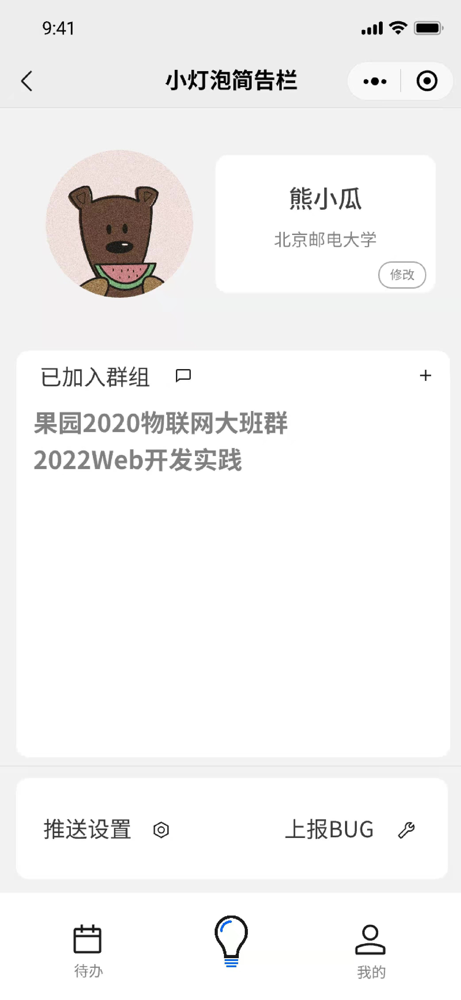
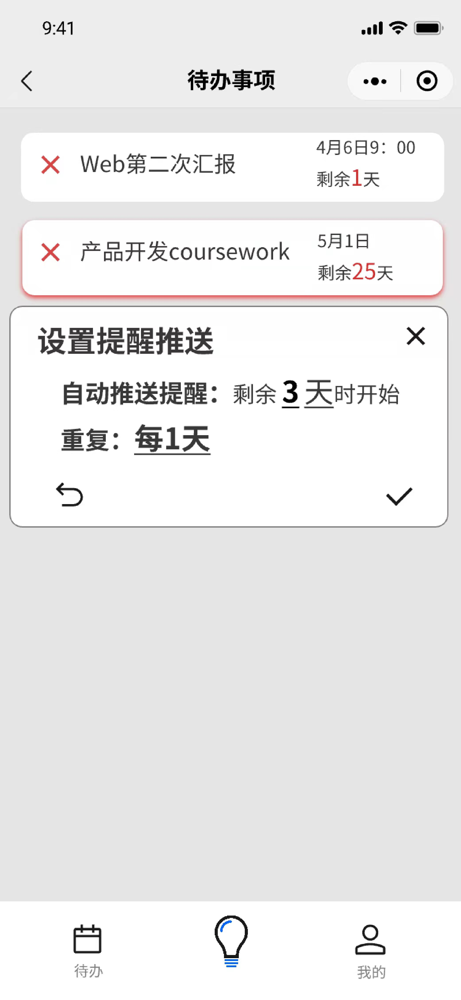
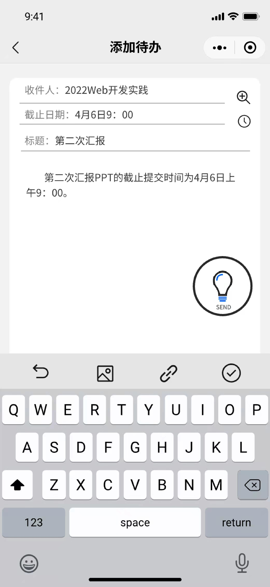
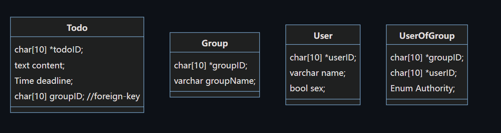

# Little-bulb-bulletin-board
## 文件目录
* *program*用于存放微信小程序项目
  * cloudfunctions用于储存云函数
  * resourse用于储存小程序资源文件
    * icons用于储存小程序的UI图标
  
  * pages用于储存小程序页面
  * utils工具
  
* images用于储存设计图
## API接口

### 调用云函数示例

```javascript
wx.cloud.init(); //初始化
wx.cloud.callFunction({
    //云函数的名称
	name : 'AddTodo',
    //传入的数据
    data : {
    	description : "Web开发",
        due : "2018-04-02",
        groupID : "45"
    },
    //接受返回数据
    success : function(res){
        console.log(res.result);
    },
    fail: console.error
    });
```

* 添加代办事项

  > 函数名 ：AddTodo
  >
  > 传入数据
  >
  > ```json
  > description : "Web开发",
  > due : "2018-04-02",
  > groupID : "45"
  > ```
  >
  > 返回数据
  >
  > 0 代表添加失败
  >
  > 1 代表添加成功
  >
  > 使用示例
  >
  > ```javascript
  > wx.cloud.init();
  > wx.cloud.callFunction({
  >     name : 'AddTodo',
  >     data : {
  >         description : "Web开发",
  >         due : "2018-04-02",
  >         groupID : "45" //通过查询获得
  >     },
  >     success : function(res){
  >         console.log(res.result);
  >         if(res.result == 0){
  >             //添加失败
  >         }else if(res.result == 1){
  >             //添加成功
  > 		}
  >     },
  >     fail: console.error
  > });
  > ```

* 添加群组

  > 函数名 ： AddGroup
  >
  > 传入数据：
  >
  > ```json
  > groupName ："web开发" 
  > ```
  >
  > 返回数据
  >
  > 0 代表添加失败
  >
  > 1 代表添加成功
  >
  > 使用示例
  >
  > ```javascript
  > wx.cloud.init();
  > wx.cloud.callFunction({
  >  name : 'AddGroup',
  >  data : {
  >      groupName : "web开发"
  >  },
  >  success : function(res){
  >      console.log(res.result);
  >      if(res.result == 0){
  >          //添加失败
  >      }else if(res.result == 1){
  >          //添加成功
  > 		}
  >  },
  >  fail: console.error
  > });
  > 
  > ```
  
* 添加用户

  > 函数名: AddUser
  > 传入数据 
  >
  > ```json
  > name : "姓名"
  > ```
  >
  > 返回数据
  >
  > 0 代表添加失败
  >
  > 1 代表添加成功
  >
  > 使用示例
  >
  > ```javascript
  > wx.cloud.init();
  > wx.cloud.callFunction({
  >  name : 'AddUser',
  >  data : {
  >      name : "姓名"
  >  },
  >  success : function(res){
  >      console.log(res.result);
  >      if(res.result == 0){
  >          //添加失败
  >      }else if(res.result == 1){
  >          //添加成功
  > 		}
  >  },
  >  fail: console.error
  > });
  > ```

* 添加用户到到群组

  > 函数名 ：AddUserToGroup
  >
  > 传入数据 （传入的ID通过查询获得）
  >
  > ```json
  > userID : "......"
  > groupID : "......."
  > ```
  >
  > 返回数据
  >
  > 0 代表添加失败
  >
  > 1 代表添加成功
  >
  > 使用示例
  >
  > ```javascript
  > wx.cloud.init();
  > wx.cloud.callFunction({
  >  name : 'AddUserToGroup',
  >  data : {
  >     userID : "......"
  >     groupID : "......."
  >  },
  >  success : function(res){
  >      console.log(res.result);
  >      if(res.result == 0){
  >          //添加失败
  >      }else if(res.result == 1){
  >          //添加成功
  > 		}
  >  },
  >  fail: console.error
  > });
  > ```

* 获取用户所在的群组

  > 函数名 ：GetGroupsOfUser
  >
  > 传入数据
  >
  > ```json
  > 无，由云端自动获得用户的wxid
  > ```
  >
  > 返回数据
  >
  > 一个json数据，通过```res.result.data```可以获得一个json的数组
  >
  > ```res.result.data[0].groupID``` 获得第一条数据的群组ID
  >
  > 使用示例
  >
  > ```javascript
  > wx.cloud.init();
  > wx.cloud.callFunction({
  >     name : 'GetGroupsOfUser',
  >     success : function(res){
  >         console.log(res.result.data[0]);//打印出第一条数据
  >     },
  >     fail: console.error
  > });
  > ```

* 获得群组的待办事项

  > 函数名 : GetTodosOfGroup
  >
  > 传入数据 （传入的ID通过查询获得）
  > ```json
  > groupID : "........"
  > ```
  >
  > 返回数据
  >
  > 一个json数据，通过```res.result.data```可以获得一个json的数组
  >
  > ```res.result.data[0].description``` 获得第一条数据的代办事项
  >
  > ```res.result.data[0].due``` 获得第一条数据的ddl
  >
  > 使用示例
  >
  > ```javascript
  > wx.cloud.init();
  > wx.cloud.callFunction({
  >      name : 'GetTodosOfGroup',
  >      data : {
  >          groupID : "......"
  >      },
  >      success : function(res){
  >          console.log(res.result.data[0]);//打印出第一条数据
  >      },
  >      fail: console.error
  > });
  > ```

* 获得一个用户的所有代办

  > 函数名 : GetTodosOfUsers
  >
  > 传入数据 （传入的ID通过查询获得）
  >
  > ```json
  > userID : "........"
  > ```
  >
  > 返回数据
  >
  > 一个储存着待办信息的Array数组，
  >
  > 数组的对象的属性， userID：用户ID； todoID：用户ID； done：0代表未完成，1代表完成
  >
  > 使用示例
  >
  > ```javascript
  > wx.cloud.init();
  > wx.cloud.callFunction({
  >      name : 'GetTodosOfUser',
  >      data: {
  >          userID : "ocFn-4u3IjIMQZ_csfo3IhzWrXJM"
  >      },
  >      success : function(res){
  >          	console.log(res.result.lenth);
  >      },
  >      fail: console.error
  > });
  > ```

* 将一个用户的一个代办设置为完成

  > 函数名 : SetTodoDone
  >
  > 传入数据 （传入的ID通过查询获得）
  >
  > ```json
  > userID : "........"
  > todoID : "........"
  > ```
  >
  > 返回数据
  >
  > 0代表设置失败，1代表设置成功
  >
  > 使用示例
  >
  > ```javascript
  > wx.cloud.init();
  > wx.cloud.callFunction({
  >  name : 'SetTodoDone',
  >  data : {
  >      userID : "ocFn-4txhpm6foAh4NMRKo_498Zw",
  >      todoID : "d4107ab16251886b061a15093c1f26f5"
  >  },
  >  success : function(res){
  > 		console.log(res.result);
  >  },
  >  fail: console.error
  > });
  > ```
  
* 添加Bug到数据库中

  > 函数名 : AddBugs
  >
  > 传入数据
  >
  > ```json
  > description : "........"
  > ```
  > 
  >返回数据
  > 
  >0代表设置失败，1代表设置成功
  > 
  >使用示例
  > 
  >```javascript
  > wx.cloud.init();
  > wx.cloud.callFunction({
  > name : 'AddBugs',
  >  data : {
  >    description : "......"
  >    },
  >    success : function(res){
  >  		console.log(res.result);
  >  },
  > fail: console.error
  >  });
  >  ```


## 设计

### 小程序界面设计

* 主界面
  
* 待办事项
  
* 添加代办
  


### 数据库设计


